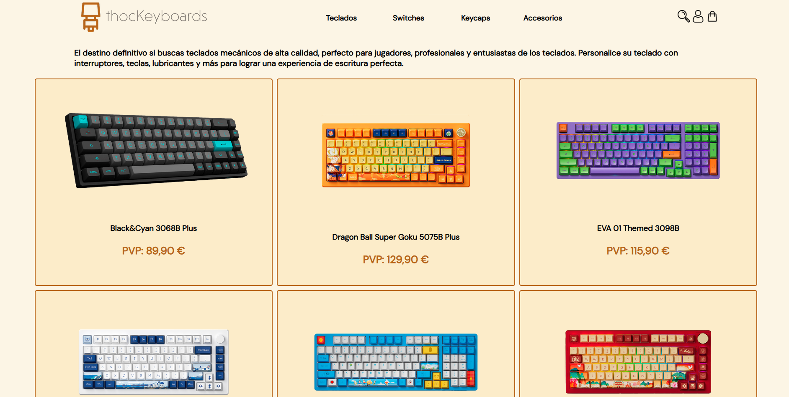

# ThocKeyboards

**ThocKeyboards** es una tienda online simulada de teclados personalizados, creada como un proyecto de práctica con HTML y CSS. Este sitio web tiene un enfoque puramente estético, sin funcionalidades como carrito de compras, pagos o gestión de productos.

## Tecnologías utilizadas:
- HTML
- CSS

## Características:
- Diseño responsive
- Simulación de catálogo de teclados
- Diseño atractivo y moderno

## Objetivo del proyecto:
Este proyecto tiene como objetivo mejorar mis habilidades en el diseño de interfaces web estáticas y aprender las bases de HTML y CSS. Aún no se ha implementado ningún tipo de funcionalidad dinámica o interactiva, como carritos de compra, pagos o base de datos.

## Planes a futuro:
- Implementación de JavaScript para funcionalidades interactivas.
- Integración de un sistema de carrito de compras y pagos.
- Mejoras en la accesibilidad y el rendimiento.

## Live demo:
https://jolumo1.github.io/ThocKeyboards/

 

 

 

